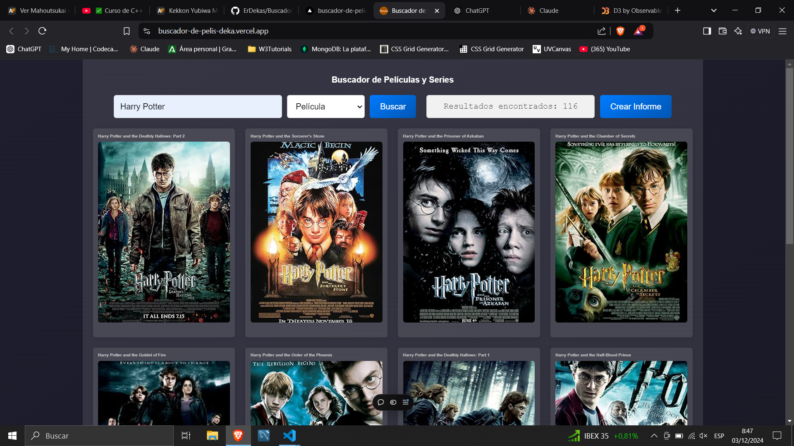

# 🎬 Movie and Series Search Application

## 📝 Description

A dynamic web application that allows users to search for movies and TV series using the OMDb API. The application provides a rich, interactive interface with features like:
- Search functionality for movies and series
- Detailed movie/series information modal
- Infinite scroll for search results
- Interactive reports and visualizations using D3.js

## 🌟 Features

### Search Capabilities
- Search for movies or series by title
- Filter results by type (Movie or Series)
- Instant search with a 300ms delay
- Infinite scrolling for more results

### Movie/Series Details
- Detailed modal with comprehensive information
- Poster image display
- Movie/Series metadata including:
  - Genre
  - IMDB Rating
  - Plot summary
  - Actors
  - Director
  - Release date

### Reporting and Visualization
- Generate interactive reports
- Bar charts using D3.js for:
  - Top-rated movies/series
  - Most voted movies/series
  - Box office performance (for movies)
  - Series start years

## 🛠 Technologies Used

- HTML5
- CSS3
- JavaScript (ES6+)
- OMDb API
- D3.js for data visualization
- THREE.js for a simply snow fall animation
- Responsive design

## 🚀 Getting Started

### Prerequisites
- Modern web browser
- OMDb API Key (free available at https://www.omdbapi.com/)

### Installation

1. Clone the repository
```bash
git clone https://github.com/ErDekas/Buscador-de-pelis.git
```

2. Replace the API Key in `index.js`
```javascript
const CONFIG = {
  API_KEY: "1a3dcaad",
  // other configurations...
};
```

3. Open `index.html` in your browser

## 📦 Project Structure

- `index.html`: Main HTML structure
- `Snow.js`: Script THREE.JS for animation
- `index.js`: JavaScript application logic
- `style.css`: Styling and responsive design
- `README.md`: Project documentation

## 🖥 Screenshots



## 🔧 Customization

You can customize:
- Search delay
- Results per page
- Scroll threshold
- Styling in `style.css`

## 📊 Performance Optimization

- Debounced search
- Infinite scrolling
- Caching movie details
- Loading spinner
- Responsive design

## 🤝 Contributing

1. Fork the repository
2. Create your feature branch (`git checkout -b feature/AmazingFeature`)
3. Commit your changes (`git commit -m 'Add some AmazingFeature'`)
4. Push to the branch (`git push origin feature/AmazingFeature`)
5. Open a Pull Request

## 📧 Contact

Pablo Linares - pabletor0505@gmail.com

Project Link: https://buscador-de-pelis-deka.vercel.app/

## 🙏 Acknowledgements

- [OMDb API](https://www.omdbapi.com/)
- [D3.js](https://d3js.org/)
- [THREE.js](https://threejs.org/)